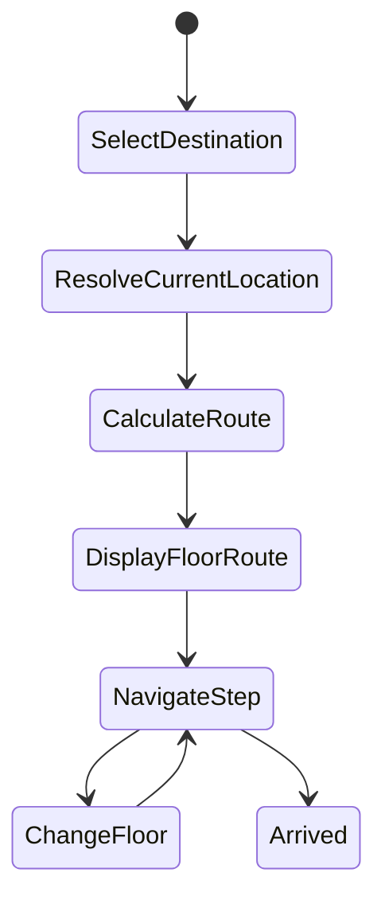
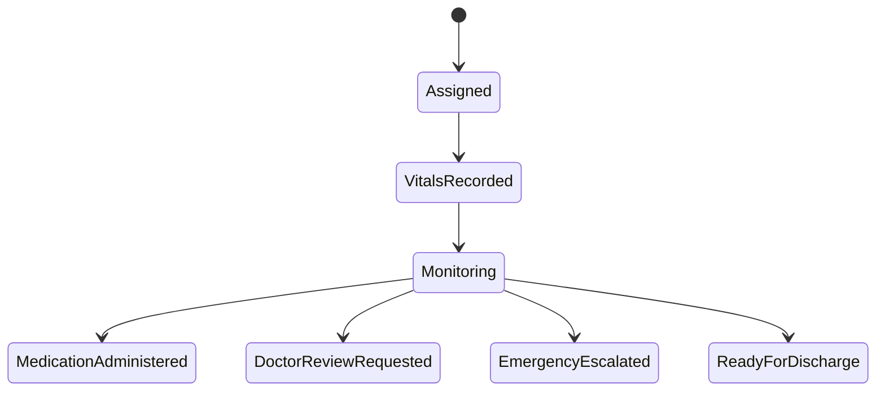
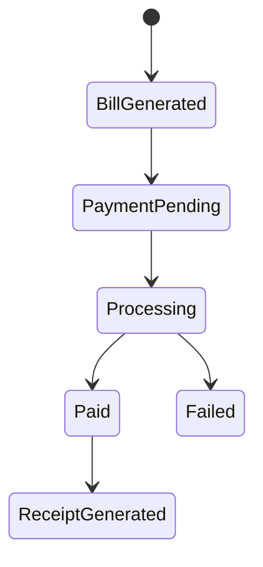
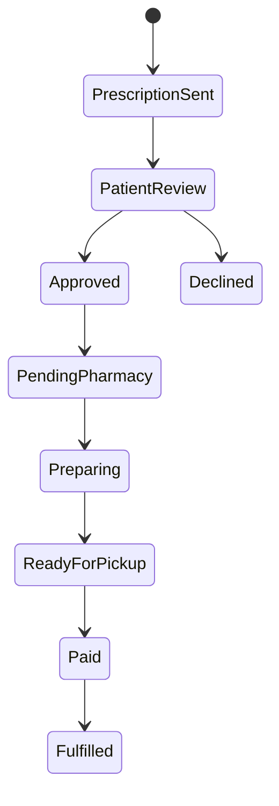
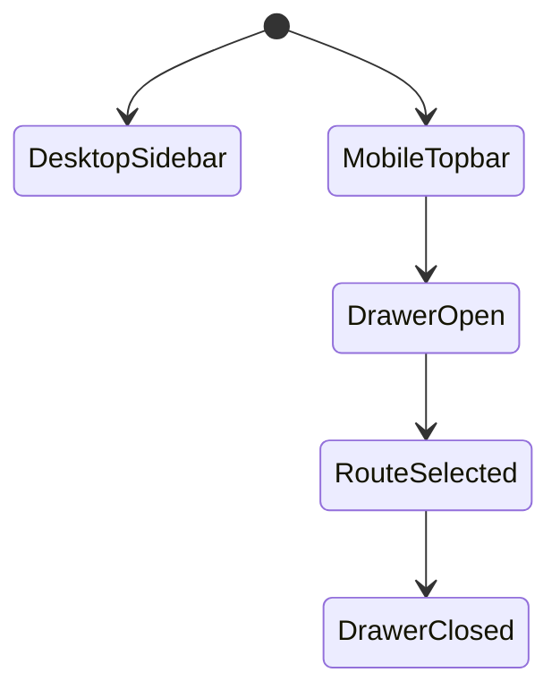
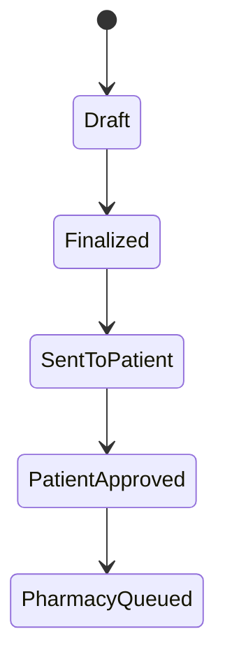
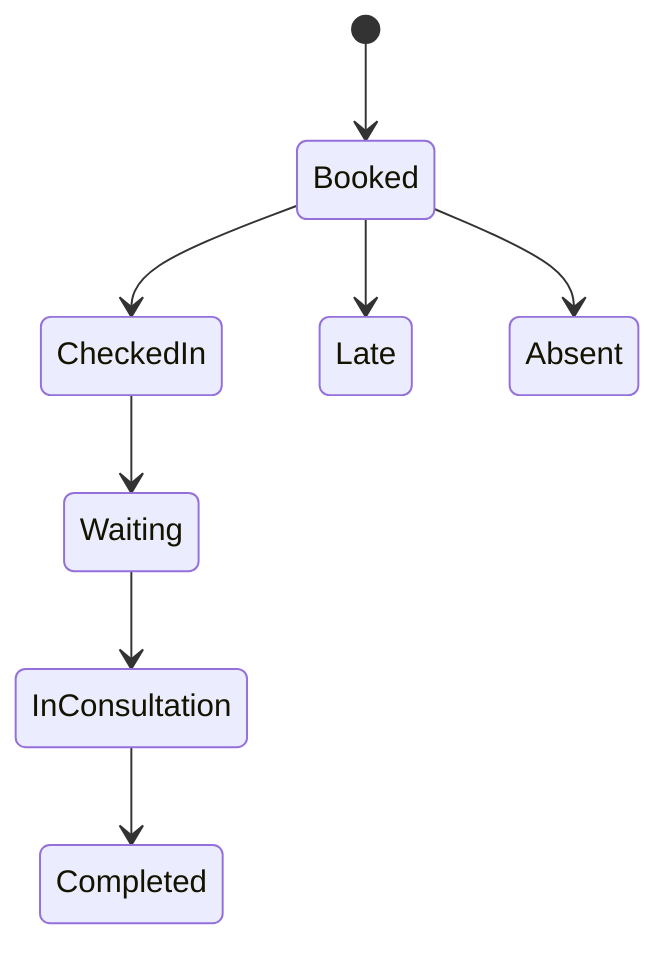
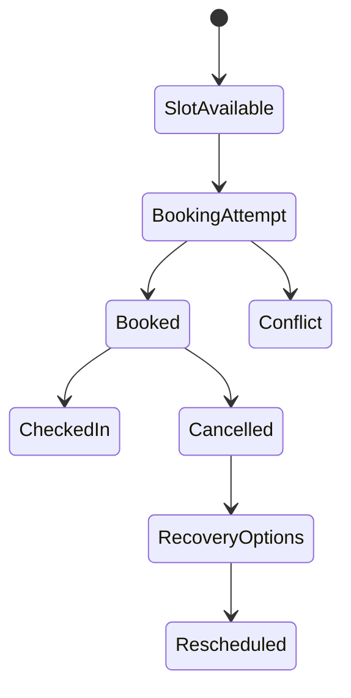

# MediFlow AI Critical Feature Gap Analysis

Date: 2026-06-20

## Current Baseline

MediFlow AI is a FastAPI + PostgreSQL + Next.js modular monolith. Existing modules cover demo JWT auth, patients, doctors, appointment booking, reception queue, doctor consultation/SOAP/prescription creation, pharmacy inventory/dispensing, basic bills, AI helpers, and the enhancement foundation tables added in the previous sprint.

Important current implementation notes:

- Database schema is still created with SQLAlchemy `Base.metadata.create_all` at startup, not Alembic migrations.
- Demo login works only when demo data is seeded. This was fixed for dev by enabling `seed_demo_data`, but production should disable it.
- Current appointment status flow is `booked -> checked_in -> in_consultation -> completed/cancelled`; the requested `waiting`, `late`, and `absent` states are missing.
- Prescription code references `pdf_path`, but the `Prescription` model currently has no `pdf_path` column.
- Pharmacy currently treats `Prescription.status == pending` as the queue; it has no patient approval step or order state machine.
- Bills exist, but payment transactions, receipts, gateway/cash/UPI/card details, and consultation bills are incomplete.
- New enhancement pages are connected to backend records, but several workflows still need dedicated product UX.
- Mobile behavior is fragile because role layouts use a fixed 256px sidebar and `ml-64` content offset.

## Task 1: Full Hospital Floor Map & Navigation System

### Current Implementation Analysis

- Patient journey tables and routes exist in `enhancements`.
- Room/bed availability exists.
- No hospital location/floor map data model exists.
- No shortest route API exists.
- No map UI exists.

### Identified Issues

- Navigation cannot be dynamic because locations are not stored in DB.
- Appointment records do not store destination location IDs.
- Patient journey steps have free-text location fields only.

### Database Changes

- Add `hospital_locations`: floor, type, name, department, room_number, coordinates, adjacency.
- Add `hospital_routes`: optional cached route edges if adjacency is not enough.
- Add `appointment_location_id` or infer through doctor cabin/department mapping.

### API Changes

- `GET /api/v1/navigation/locations`
- `GET /api/v1/navigation/floors`
- `GET /api/v1/navigation/route?from=&to=`
- `GET /api/v1/navigation/appointment/{appointment_id}`

### Frontend Changes

- Add patient navigation page with floor tabs, search, route list, floor transition steps.
- Add reception navigation view for patient guidance.
- Add journey step integration.

### Backend Changes

- Implement location service with graph route finding.
- Seed default hospital locations if empty.
- Link doctor departments to location records.

### State Flow

### Testing Plan

- Verify locations load from DB.
- Verify search returns OPD, lab, MRI/CT, ICU, pharmacy, billing, emergency.
- Verify cross-floor route includes elevator/stairs.
- Verify current appointment opens the correct destination.

### Edge Cases

- Missing appointment location.
- Disabled elevator.
- Multiple matching destinations.
- Patient starts from a non-reception location.

### Mobile Considerations

- Floor selector must be horizontal scroll/tabs.
- Route steps must stack vertically.
- Map must avoid fixed pixel width.

### Security Considerations

- Public map can expose generic areas.
- Appointment-specific location requires auth.
- Staff-only locations should be marked restricted.

## Task 2: Complete Nurse Dashboard

### Current Implementation Analysis

- Backend role guard recognizes `nurse`.
- Frontend auth type now includes `nurse`.
- No seeded nurse user.
- No nurse layout/dashboard exists.
- Vitals model exists from enhancement foundation.
- Emergency and bed models exist.

### Identified Issues

- Nurse cannot log in through demo credentials.
- No nurse assignment model.
- No medication administration workflow.
- No doctor review request workflow.

### Database Changes

- Add `nurse_assignments`.
- Add `nurse_notes`.
- Reuse `patient_vitals`, `medication_adherence_events`, `beds`, `emergency_escalations`.

### API Changes

- `GET /api/v1/nurse/dashboard`
- `POST /api/v1/nurse/vitals`
- `PATCH /api/v1/nurse/patients/{patient_id}/status`
- `POST /api/v1/nurse/medications/administered`
- `POST /api/v1/nurse/notes`
- `POST /api/v1/nurse/doctor-review`

### Frontend Changes

- Add `/nurse/dashboard`, `/nurse/vitals`, `/nurse/beds`, `/nurse/emergencies`.
- Add nurse sidebar and role redirect.

### Backend Changes

- Add nurse router and service.
- Seed nurse demo user.
- Enforce nurse/patient assignment checks.

### State Flow

### Testing Plan

- Nurse login.
- Record vitals and verify patient profile updates.
- Create emergency and verify doctor/reception visibility.
- Update bed occupancy and verify reception room dashboard.

### Edge Cases

- Duplicate vitals.
- Invalid vitals ranges.
- Nurse attempts to access unassigned patient.
- Patient transfer between beds.

### Mobile Considerations

- Vitals form must be single-column on phones.
- Queue cards must replace wide tables.

### Security Considerations

- Nurse endpoints require `nurse` or `admin`.
- Audit all vitals, notes, medication administration, and emergency actions.

## Task 3: Payment Integration

### Current Implementation Analysis

- `bills` table exists.
- Pharmacy can mark bill paid with a simulated method.
- No payment transaction table.
- No consultation bill generation.
- No receipt endpoint.

### Identified Issues

- Payment is a status toggle, not a payment workflow.
- No transaction ID/timestamp storage except limited bill fields.
- No support for cash/UPI/card/gateway distinctions.

### Database Changes

- Add `payment_transactions`.
- Add receipt metadata through transaction rows.

### API Changes

- `POST /api/v1/payments/consultation-bills`
- `POST /api/v1/payments/pharmacy-bills/{bill_id}/pay`
- `GET /api/v1/payments/receipts/{transaction_id}`
- `GET /api/v1/payments/my-bills`

### Frontend Changes

- Patient payment page.
- Pharmacy billing payment method selector.
- Receipt view/download.

### Backend Changes

- Payment service for `cash`, `upi`, `card`, `gateway`.
- Generate unique transaction IDs.
- Update bill status atomically.

### State Flow

### Testing Plan

- Consultation completion creates bill.
- Pharmacy order creates bill.
- Pay by cash/UPI/card/gateway simulation.
- Receipt returns patient, invoice, transaction data.

### Edge Cases

- Double payment.
- Payment for another patient.
- Failed gateway callback.
- Bill cancelled after payment.

### Mobile Considerations

- Payment method buttons must be touch-friendly.
- Receipt must fit small screens.

### Security Considerations

- Never trust client-only payment success.
- Patient can only pay own bills.
- Audit all payment status changes.

## Task 4: Pharmacy Prescription Queue System

### Current Implementation Analysis

- Doctor creates prescription.
- `Prescription.status = pending` appears in pharmacy queue.
- Pharmacy dispenses directly and creates bill.

### Identified Issues

- Missing patient review/approval.
- Missing order state machine.
- Missing ready-for-pickup notifications.
- Queue statuses are too coarse.

### Database Changes

- Add `pharmacy_orders`.
- Link order to prescription, patient, bill.

### API Changes

- `GET /api/v1/pharmacy/orders`
- `PATCH /api/v1/pharmacy/orders/{id}/status`
- `POST /api/v1/pharmacy/orders/{id}/approve`
- `POST /api/v1/pharmacy/orders/{id}/pay`

### Frontend Changes

- Patient prescription approval page.
- Pharmacy queue tabs: pending, preparing, ready, completed.
- Notification after ready.

### Backend Changes

- Create pharmacy order when prescription is finalized.
- Move inventory deduction to order fulfillment/dispense step.
- Generate bill when order is prepared or ready.

### State Flow

### Testing Plan

- Doctor finalizes prescription.
- Patient sees prescription and approves.
- Pharmacy sees order.
- Pharmacist marks preparing/ready.
- Patient/pharmacist pays.
- Order fulfilled and bill paid.

### Edge Cases

- Medicine out of stock.
- Patient rejects one medicine.
- Pharmacist proposes substitute.
- Order paid but not picked up.

### Mobile Considerations

- Queue tabs must scroll.
- Prescription review cards replace wide rows.

### Security Considerations

- Patients can approve only own prescriptions.
- Pharmacists cannot alter locked prescription medicine without substitution approval.

## Task 5: Mobile Optimization

### Current Implementation Analysis

- Many pages use responsive grids.
- Role layouts use fixed sidebar and `ml-64`, causing mobile overflow.
- Tables depend on horizontal scroll inconsistently.

### Identified Issues

- Sidebar consumes screen width on phones.
- Several pages assume desktop width.
- Enhancement data grid needs mobile cards.

### Database Changes

- None.

### API Changes

- None.

### Frontend Changes

- Add responsive app shell with mobile drawer.
- Replace `ml-64` with responsive content offset.
- Make tables scroll or cardify.
- Ensure forms are single-column on small screens.

### Backend Changes

- None.

### State Flow

### Testing Plan

- Playwright screenshots at 390x844, 768x1024, 1440x900.
- Verify no horizontal body overflow.
- Verify sidebar navigation is usable on mobile.

### Edge Cases

- Long patient names/PIDs.
- Large medicine lists.
- Wide billing tables.

### Security Considerations

- Do not hide protected routes only via mobile nav.

## Task 6: Prescription Workflow Improvements

### Current Implementation Analysis

- Doctor consultation page loads patient summary/history.
- Diagnosis can be derived from SOAP assessment.
- AI prescription generation exists.
- Save prescription immediately closes visit.

### Identified Issues

- No explicit "draft vs final" lock.
- No patient review send step.
- No validation for empty medicines.
- Missing `pdf_path` model field causes runtime errors in routes that reference it.

### Database Changes

- Add or avoid `pdf_path`.
- Add pharmacy order table.
- Use prescription status: draft, sent_to_patient, approved, locked, cancelled.

### API Changes

- `POST /api/v1/consultations/prescription/draft`
- `POST /api/v1/consultations/prescription/{id}/finish`
- `POST /api/v1/consultations/prescription/{id}/patient-approve`

### Frontend Changes

- Pre-fill current meds, previous prescriptions, allergies.
- Add Finish Prescription button.
- Disable finalize until diagnosis and medicines are valid.

### Backend Changes

- Validate medicines list.
- Lock final prescription.
- Create pharmacy order and patient notification.

### State Flow

### Testing Plan

- Generate and add manual medicine.
- Attempt finish without medicine.
- Finish with valid medicine creates order.
- Patient can approve own prescription.

### Edge Cases

- Duplicate medicine names.
- Known allergy conflict.
- Doctor edits after final lock.

### Mobile Considerations

- Medicine rows must stack.
- Finish button should remain visible near action area.

### Security Considerations

- Only prescribing doctor/admin can finalize.
- Final prescription lock prevents silent tampering.

## Task 7: Reception Check-In & Presence Confirmation

### Current Implementation Analysis

- Reception dashboard/search exists.
- Check-in sets status to `checked_in`.
- Queue includes `checked_in` and `in_consultation`.

### Identified Issues

- Missing absent/late status actions.
- Missing explicit `waiting` state.
- Dashboard labels "waiting" currently mean `booked`.
- Queue generation is count-based and not locked.

### Database Changes

- No new table required initially.
- Add statuses to appointment state policy.

### API Changes

- `POST /appointments/check-in/{id}` sets `checked_in`.
- `PATCH /appointments/{id}/presence` for checked_in, waiting, late, absent.
- `PATCH /appointments/{id}/status` validates transitions.

### Frontend Changes

- New check-in action buttons: arrived, waiting, late, absent.
- Dashboard counts use actual states.

### Backend Changes

- Queue status should be `waiting`.
- Validate status transitions.
- Recompute queue position safely.

### State Flow

### Testing Plan

- Book appointment, check in, mark waiting, start consultation, complete.
- Mark absent and verify queue exclusion.
- Mark late and verify dashboard count.

### Edge Cases

- Check in already completed appointment.
- Late patient after slot passed.
- Duplicate check-in.

### Mobile Considerations

- Reception action buttons must wrap.
- Search results must be card-based.

### Security Considerations

- Reception/admin only for presence updates.
- Audit presence changes.

## Task 8: Appointment & Time Slot Validation

### Current Implementation Analysis

- `get_available_slots` hides existing booked slots.
- `book_appointment` checks conflict but does not lock rows.
- Cancellation/rescheduling are incomplete.

### Identified Issues

- Concurrent double booking possible.
- No reschedule endpoint.
- No cancellation recovery integration.
- Available slots do not account for doctor exceptions or completed/cancelled edge states fully.

### Database Changes

- Ideally add unique partial index on `(doctor_id, scheduled_at)` where status is active.
- Add appointment change events for audit/history.

### API Changes

- `POST /appointments/book` with transaction/lock.
- `POST /appointments/{id}/cancel`
- `PATCH /appointments/{id}/reschedule`
- `GET /appointments/{id}/recovery-options`

### Frontend Changes

- Patient cancellation/recovery UI.
- Clear slot conflict errors.
- Refresh slots after booking attempt.

### Backend Changes

- Use transaction and row-level conflict protection.
- Validate doctor exists.
- Validate future slots.
- Recompute queue positions.

### State Flow

### Testing Plan

- Book same slot twice and expect second conflict.
- Cancel and verify slot returns.
- Reception sees booking.
- Complete consultation and generate billing.

### Edge Cases

- Past date booking.
- Invalid doctor ID.
- Timezone boundary.
- Emergency interruption affects queue.

### Mobile Considerations

- Slot grid should be 2 columns on phone.
- Date input must remain usable.

### Security Considerations

- Patients can modify only own appointments.
- Staff updates audited.

