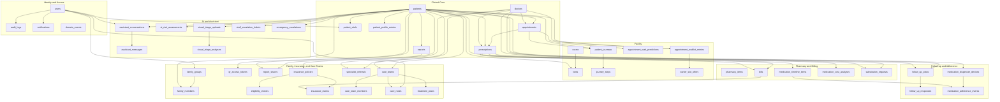

# Database EER Diagram

This EER diagram groups the schema into domains. It includes the core MVP tables plus enhancement tables present in the backend model layer.

```mermaid
flowchart TB
  subgraph Identity["Identity and Access"]
    User["users"]
    AuditLog["audit_logs"]
    Notification["notifications"]
    DomainEvent["domain_events"]
  end

  subgraph ClinicalCore["Clinical Core"]
    Patient["patients"]
    Doctor["doctors"]
    Appointment["appointments"]
    Prescription["prescriptions"]
    Report["reports"]
    PatientVital["patient_vitals"]
    PatientProfileEntry["patient_profile_entries"]
  end

  subgraph PharmacyBilling["Pharmacy and Billing"]
    PharmacyItem["pharmacy_items"]
    Bill["bills"]
    MedicationTimelineItem["medication_timeline_items"]
    MedicationCostAnalysis["medication_cost_analyses"]
    SubstitutionRequest["substitution_requests"]
  end

  subgraph AIAndAssistant["AI and Assistant"]
    AssistantConversation["assistant_conversations"]
    AssistantMessage["assistant_messages"]
    AiRiskAssessment["ai_risk_assessments"]
    VisualTriageUpload["visual_triage_uploads"]
    VisualTriageAnalysis["visual_triage_analyses"]
    StaffEscalationTicket["staff_escalation_tickets"]
    EmergencyEscalation["emergency_escalations"]
  end

  subgraph FollowUpAndAdherence["Follow-up and Adherence"]
    FollowUpPlan["follow_up_plans"]
    FollowUpResponse["follow_up_responses"]
    DispenserDevice["medication_dispenser_devices"]
    AdherenceEvent["medication_adherence_events"]
  end

  subgraph Facility["Facility"]
    Room["rooms"]
    Bed["beds"]
    PatientJourney["patient_journeys"]
    JourneyStep["journey_steps"]
    WaitPrediction["appointment_wait_predictions"]
    WaitlistEntry["appointment_waitlist_entries"]
    SlotOffer["earlier_slot_offers"]
  end

  subgraph FamilyInsuranceCare["Family, Insurance, and Care Teams"]
    FamilyGroup["family_groups"]
    FamilyMember["family_members"]
    InsurancePolicy["insurance_policies"]
    EligibilityCheck["eligibility_checks"]
    InsuranceClaim["insurance_claims"]
    QrAccessToken["qr_access_tokens"]
    ReportShare["report_shares"]
    CareTeam["care_teams"]
    CareTeamMember["care_team_members"]
    CareNote["care_notes"]
    TreatmentPlan["treatment_plans"]
    SpecialistReferral["specialist_referrals"]
  end

  User --> AuditLog
  User --> Notification
  User --> AssistantConversation
  User --> FamilyGroup
  User --> PatientVital
  User --> CareNote

  Patient --> Appointment
  Doctor --> Appointment
  Appointment --> Prescription
  Patient --> Prescription
  Doctor --> Prescription
  Patient --> Report
  Patient --> PatientVital
  Patient --> PatientProfileEntry

  Prescription --> Bill
  Patient --> Bill
  Prescription --> MedicationTimelineItem
  Prescription --> MedicationCostAnalysis
  Prescription --> SubstitutionRequest
  Doctor --> SubstitutionRequest

  Patient --> AssistantConversation
  AssistantConversation --> AssistantMessage
  Patient --> AiRiskAssessment
  Patient --> VisualTriageUpload
  VisualTriageUpload --> VisualTriageAnalysis
  Patient --> StaffEscalationTicket
  Patient --> EmergencyEscalation

  Patient --> FollowUpPlan
  Doctor --> FollowUpPlan
  FollowUpPlan --> FollowUpResponse
  Patient --> DispenserDevice
  DispenserDevice --> AdherenceEvent
  MedicationTimelineItem --> AdherenceEvent

  Room --> Bed
  Patient --> Bed
  Patient --> PatientJourney
  Appointment --> PatientJourney
  PatientJourney --> JourneyStep
  Appointment --> WaitPrediction
  Patient --> WaitlistEntry
  Doctor --> WaitlistEntry
  WaitlistEntry --> SlotOffer

  FamilyGroup --> FamilyMember
  Patient --> FamilyMember
  Patient --> InsurancePolicy
  InsurancePolicy --> EligibilityCheck
  InsurancePolicy --> InsuranceClaim
  Bill --> InsuranceClaim
  Patient --> QrAccessToken
  Report --> ReportShare
  Patient --> ReportShare
  Patient --> CareTeam
  Doctor --> CareTeam
  CareTeam --> CareTeamMember
  CareTeam --> CareNote
  CareTeam --> TreatmentPlan
  Patient --> SpecialistReferral
  Doctor --> SpecialistReferral
```

