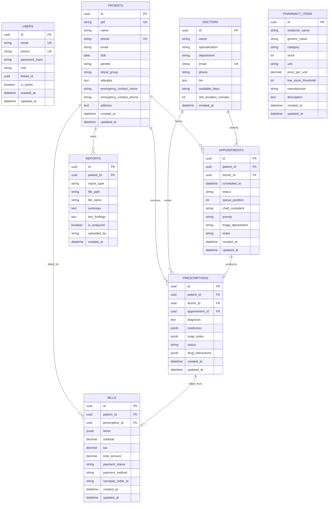

# Database ER Diagram

This ER diagram focuses on the core MVP entities currently used by the live patient, doctor, reception, pharmacy, and AI workflows.

```mermaid
erDiagram
  USERS {
    uuid id PK
    string email UK
    string phone UK
    string password_hash
    string role
    uuid linked_id
    boolean is_active
    datetime created_at
    datetime updated_at
  }

  PATIENTS {
    uuid id PK
    string pid UK
    string name
    string phone UK
    string email
    date dob
    string gender
    string blood_group
    text allergies
    string emergency_contact_name
    string emergency_contact_phone
    text address
    datetime created_at
    datetime updated_at
  }

  DOCTORS {
    uuid id PK
    string name
    string specialization
    string department
    string email UK
    string phone
    text bio
    string available_days
    int slot_duration_minutes
    datetime created_at
  }

  APPOINTMENTS {
    uuid id PK
    uuid patient_id FK
    uuid doctor_id FK
    datetime scheduled_at
    string status
    int queue_position
    string chief_complaint
    string priority
    string triage_department
    string notes
    datetime created_at
    datetime updated_at
  }

  PRESCRIPTIONS {
    uuid id PK
    uuid patient_id FK
    uuid doctor_id FK
    uuid appointment_id FK
    text diagnosis
    jsonb medicines
    jsonb soap_notes
    string status
    jsonb drug_interactions
    datetime created_at
    datetime updated_at
  }

  PHARMACY_ITEMS {
    uuid id PK
    string medicine_name
    string generic_name
    string category
    int stock
    string unit
    decimal price_per_unit
    int low_stock_threshold
    string manufacturer
    text description
    datetime created_at
    datetime updated_at
  }

  BILLS {
    uuid id PK
    uuid patient_id FK
    uuid prescription_id FK
    jsonb items
    decimal subtotal
    decimal tax
    decimal total_amount
    string payment_status
    string payment_method
    string razorpay_order_id
    datetime created_at
    datetime updated_at
  }

  REPORTS {
    uuid id PK
    uuid patient_id FK
    string report_type
    string file_path
    string file_name
    text summary
    text key_findings
    boolean is_analyzed
    string uploaded_by
    datetime created_at
  }

  PATIENTS ||--o{ APPOINTMENTS : books
  DOCTORS ||--o{ APPOINTMENTS : attends
  PATIENTS ||--o{ PRESCRIPTIONS : receives
  DOCTORS ||--o{ PRESCRIPTIONS : writes
  APPOINTMENTS ||--o| PRESCRIPTIONS : produces
  PATIENTS ||--o{ BILLS : billed_for
  PRESCRIPTIONS ||--o| BILLS : billed_from
  PATIENTS ||--o{ REPORTS : owns
```

