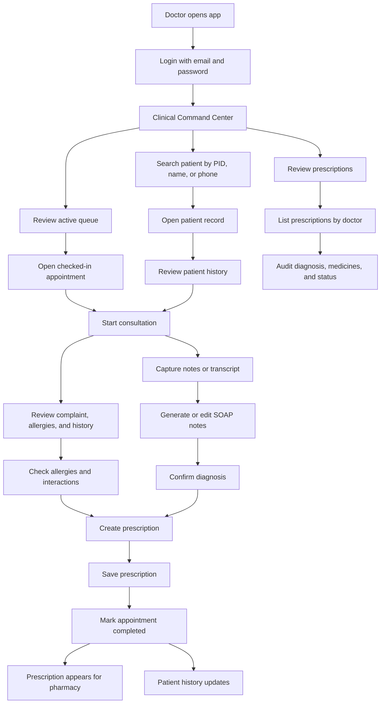

# Doctor Flow

```mermaid
flowchart TD
  Start["Doctor opens app"] --> Login["Login with email and password"]
  Login --> Dashboard["Clinical Command Center"]
  Dashboard --> Queue["Review active queue"]
  Dashboard --> Search["Search patient by PID, name, or phone"]
  Dashboard --> RxReview["Review prescriptions"]

  Queue --> PickVisit["Open checked-in appointment"]
  Search --> PatientRecord["Open patient record"]
  PatientRecord --> History["Review patient history"]
  PickVisit --> Consultation["Start consultation"]
  History --> Consultation

  Consultation --> Transcript["Capture notes or transcript"]
  Consultation --> Symptoms["Review complaint, allergies, and history"]
  Transcript --> SOAP["Generate or edit SOAP notes"]
  Symptoms --> DrugSafety["Check allergies and interactions"]
  SOAP --> Diagnosis["Confirm diagnosis"]
  DrugSafety --> Prescription["Create prescription"]
  Diagnosis --> Prescription

  Prescription --> SaveRx["Save prescription"]
  SaveRx --> CompleteVisit["Mark appointment completed"]
  CompleteVisit --> PharmacyQueue["Prescription appears for pharmacy"]
  CompleteVisit --> PatientHistory["Patient history updates"]

  RxReview --> PrescriptionList["List prescriptions by doctor"]
  PrescriptionList --> AuditRx["Audit diagnosis, medicines, and status"]
```

