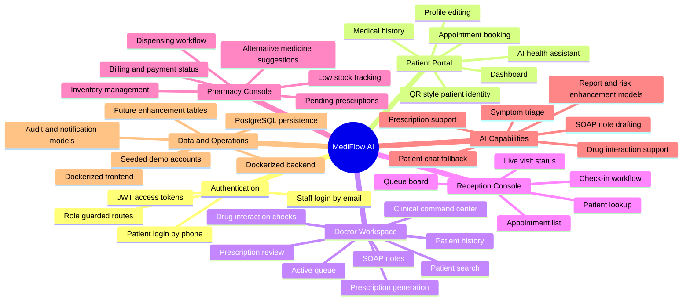

# Feature List

```mermaid
mindmap
  root((MediFlow AI))
    Authentication
      Patient login by phone
      Staff login by email
      JWT access tokens
      Role guarded routes
    Patient Portal
      Dashboard
      Appointment booking
      Medical history
      AI health assistant
      Profile editing
      QR style patient identity
    Doctor Workspace
      Clinical command center
      Active queue
      Patient search
      Patient history
      SOAP notes
      Prescription generation
      Prescription review
      Drug interaction checks
    Reception Console
      Queue board
      Patient lookup
      Appointment list
      Check-in workflow
      Live visit status
    Pharmacy Console
      Pending prescriptions
      Dispensing workflow
      Inventory management
      Low stock tracking
      Billing and payment status
      Alternative medicine suggestions
    AI Capabilities
      Symptom triage
      SOAP note drafting
      Prescription support
      Drug interaction support
      Patient chat fallback
      Report and risk enhancement models
    Data and Operations
      PostgreSQL persistence
      Seeded demo accounts
      Dockerized frontend
      Dockerized backend
      Audit and notification models
      Future enhancement tables
```

