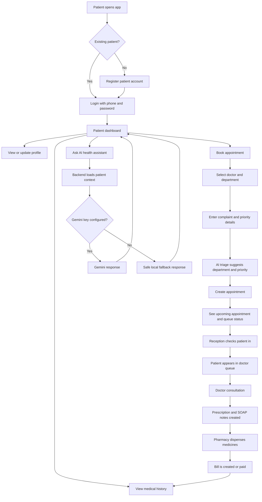

# Patient Flow

```mermaid
flowchart TD
  Start["Patient opens app"] --> AuthChoice{"Existing patient?"}
  AuthChoice -->|No| Register["Register patient account"]
  AuthChoice -->|Yes| Login["Login with phone and password"]
  Register --> Login
  Login --> Dashboard["Patient dashboard"]

  Dashboard --> Profile["View or update profile"]
  Dashboard --> Book["Book appointment"]
  Dashboard --> History["View medical history"]
  Dashboard --> Chat["Ask AI health assistant"]

  Book --> SelectDoctor["Select doctor and department"]
  SelectDoctor --> Symptoms["Enter complaint and priority details"]
  Symptoms --> Triage["AI triage suggests department and priority"]
  Triage --> CreateAppointment["Create appointment"]
  CreateAppointment --> AppointmentStatus["See upcoming appointment and queue status"]

  AppointmentStatus --> ReceptionCheckIn["Reception checks patient in"]
  ReceptionCheckIn --> Queue["Patient appears in doctor queue"]
  Queue --> Consultation["Doctor consultation"]
  Consultation --> Prescription["Prescription and SOAP notes created"]
  Prescription --> Pharmacy["Pharmacy dispenses medicines"]
  Pharmacy --> Bill["Bill is created or paid"]
  Bill --> History

  Chat --> Context["Backend loads patient context"]
  Context --> GeminiAvailable{"Gemini key configured?"}
  GeminiAvailable -->|Yes| GeminiAnswer["Gemini response"]
  GeminiAvailable -->|No| FallbackAnswer["Safe local fallback response"]
  GeminiAnswer --> Dashboard
  FallbackAnswer --> Dashboard
```

