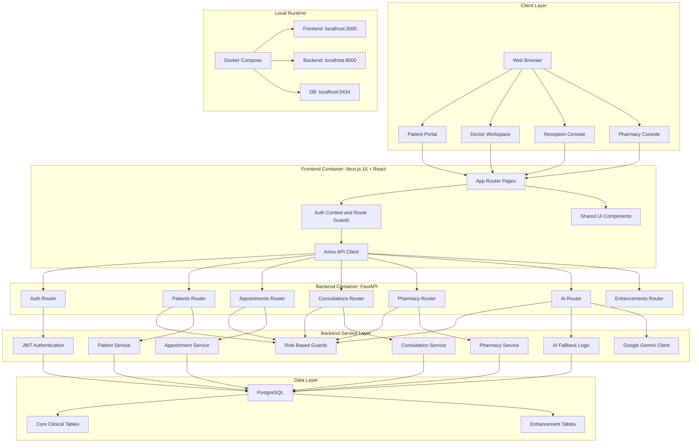

# System Architecture

```mermaid
flowchart TB
  subgraph Client["Client Layer"]
    Browser["Web Browser"]
    PatientUI["Patient Portal"]
    DoctorUI["Doctor Workspace"]
    ReceptionUI["Reception Console"]
    PharmacyUI["Pharmacy Console"]
  end

  subgraph Frontend["Frontend Container: Next.js 16 + React"]
    AppRouter["App Router Pages"]
    AuthContext["Auth Context and Route Guards"]
    ApiClient["Axios API Client"]
    UIComponents["Shared UI Components"]
  end

  subgraph Backend["Backend Container: FastAPI"]
    AuthAPI["Auth Router"]
    PatientAPI["Patients Router"]
    AppointmentAPI["Appointments Router"]
    ConsultationAPI["Consultations Router"]
    PharmacyAPI["Pharmacy Router"]
    AiAPI["AI Router"]
    EnhancementAPI["Enhancements Router"]
  end

  subgraph Services["Backend Service Layer"]
    JWT["JWT Authentication"]
    RoleGuards["Role Based Guards"]
    PatientSvc["Patient Service"]
    AppointmentSvc["Appointment Service"]
    ConsultationSvc["Consultation Service"]
    PharmacySvc["Pharmacy Service"]
    AiFallback["AI Fallback Logic"]
    Gemini["Google Gemini Client"]
  end

  subgraph Data["Data Layer"]
    Postgres["PostgreSQL"]
    CoreTables["Core Clinical Tables"]
    EnhancementTables["Enhancement Tables"]
  end

  subgraph Infra["Local Runtime"]
    DockerCompose["Docker Compose"]
    BackendPort["Backend: localhost:8000"]
    FrontendPort["Frontend: localhost:3000"]
    DbPort["DB: localhost:5434"]
  end

  Browser --> PatientUI
  Browser --> DoctorUI
  Browser --> ReceptionUI
  Browser --> PharmacyUI
  PatientUI --> AppRouter
  DoctorUI --> AppRouter
  ReceptionUI --> AppRouter
  PharmacyUI --> AppRouter
  AppRouter --> AuthContext
  AppRouter --> UIComponents
  AuthContext --> ApiClient
  ApiClient --> AuthAPI
  ApiClient --> PatientAPI
  ApiClient --> AppointmentAPI
  ApiClient --> ConsultationAPI
  ApiClient --> PharmacyAPI
  ApiClient --> AiAPI
  ApiClient --> EnhancementAPI

  AuthAPI --> JWT
  PatientAPI --> RoleGuards
  AppointmentAPI --> RoleGuards
  ConsultationAPI --> RoleGuards
  PharmacyAPI --> RoleGuards
  AiAPI --> RoleGuards

  PatientAPI --> PatientSvc
  AppointmentAPI --> AppointmentSvc
  ConsultationAPI --> ConsultationSvc
  PharmacyAPI --> PharmacySvc
  AiAPI --> AiFallback
  AiAPI --> Gemini

  JWT --> Postgres
  PatientSvc --> Postgres
  AppointmentSvc --> Postgres
  ConsultationSvc --> Postgres
  PharmacySvc --> Postgres
  AiFallback --> Postgres
  Postgres --> CoreTables
  Postgres --> EnhancementTables

  DockerCompose --> FrontendPort
  DockerCompose --> BackendPort
  DockerCompose --> DbPort
```

