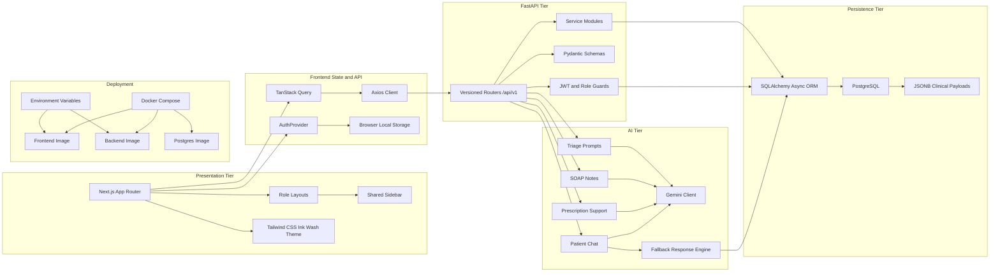
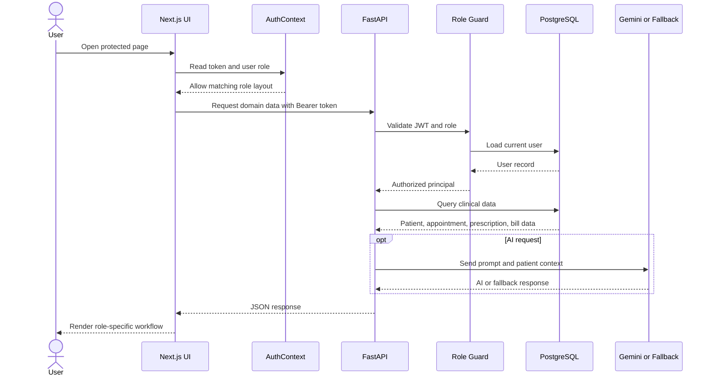

# System Design

```mermaid
flowchart LR
  subgraph Presentation["Presentation Tier"]
    NextPages["Next.js App Router"]
    RoleLayouts["Role Layouts"]
    SharedSidebar["Shared Sidebar"]
    TailwindTheme["Tailwind CSS Ink Wash Theme"]
  end

  subgraph StateAndAPI["Frontend State and API"]
    AuthProvider["AuthProvider"]
    ReactQuery["TanStack Query"]
    AxiosClient["Axios Client"]
    LocalStorage["Browser Local Storage"]
  end

  subgraph API["FastAPI Tier"]
    Routers["Versioned Routers /api/v1"]
    Guards["JWT and Role Guards"]
    Schemas["Pydantic Schemas"]
    Services["Service Modules"]
  end

  subgraph AI["AI Tier"]
    Triage["Triage Prompts"]
    SOAP["SOAP Notes"]
    PrescriptionAI["Prescription Support"]
    Chat["Patient Chat"]
    Gemini["Gemini Client"]
    Fallback["Fallback Response Engine"]
  end

  subgraph Persistence["Persistence Tier"]
    SQLAlchemy["SQLAlchemy Async ORM"]
    Postgres["PostgreSQL"]
    JSONB["JSONB Clinical Payloads"]
  end

  subgraph Deployment["Deployment"]
    DockerCompose["Docker Compose"]
    FrontendImage["Frontend Image"]
    BackendImage["Backend Image"]
    DbImage["Postgres Image"]
    Env["Environment Variables"]
  end

  NextPages --> RoleLayouts
  RoleLayouts --> SharedSidebar
  NextPages --> TailwindTheme
  NextPages --> AuthProvider
  NextPages --> ReactQuery
  AuthProvider --> LocalStorage
  ReactQuery --> AxiosClient
  AxiosClient --> Routers

  Routers --> Guards
  Routers --> Schemas
  Routers --> Services
  Routers --> Triage
  Routers --> SOAP
  Routers --> PrescriptionAI
  Routers --> Chat

  Triage --> Gemini
  SOAP --> Gemini
  PrescriptionAI --> Gemini
  Chat --> Gemini
  Chat --> Fallback

  Services --> SQLAlchemy
  Guards --> SQLAlchemy
  Fallback --> SQLAlchemy
  SQLAlchemy --> Postgres
  Postgres --> JSONB

  DockerCompose --> FrontendImage
  DockerCompose --> BackendImage
  DockerCompose --> DbImage
  Env --> BackendImage
  Env --> FrontendImage
```

```mermaid
sequenceDiagram
  actor User
  participant UI as Next.js UI
  participant Auth as AuthContext
  participant API as FastAPI
  participant Guard as Role Guard
  participant DB as PostgreSQL
  participant AI as Gemini or Fallback

  User->>UI: Open protected page
  UI->>Auth: Read token and user role
  Auth-->>UI: Allow matching role layout
  UI->>API: Request domain data with Bearer token
  API->>Guard: Validate JWT and role
  Guard->>DB: Load current user
  DB-->>Guard: User record
  Guard-->>API: Authorized principal
  API->>DB: Query clinical data
  DB-->>API: Patient, appointment, prescription, bill data
  opt AI request
    API->>AI: Send prompt and patient context
    AI-->>API: AI or fallback response
  end
  API-->>UI: JSON response
  UI-->>User: Render role-specific workflow
```

