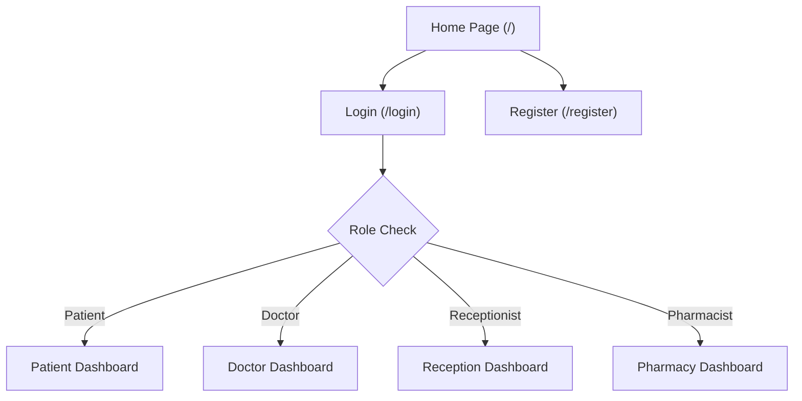
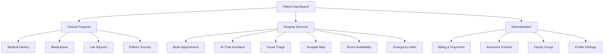
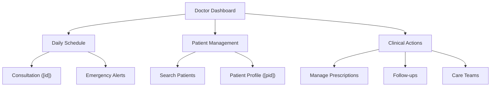
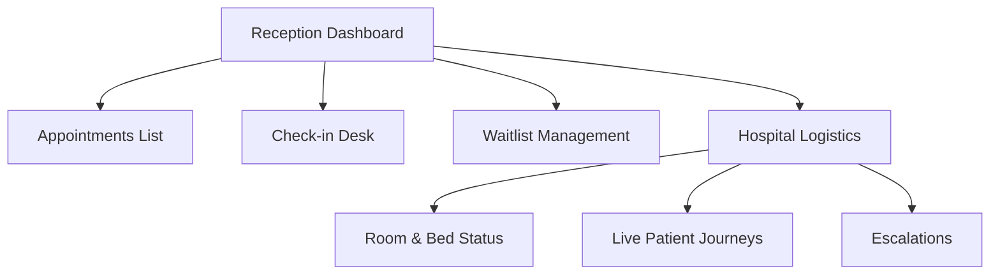
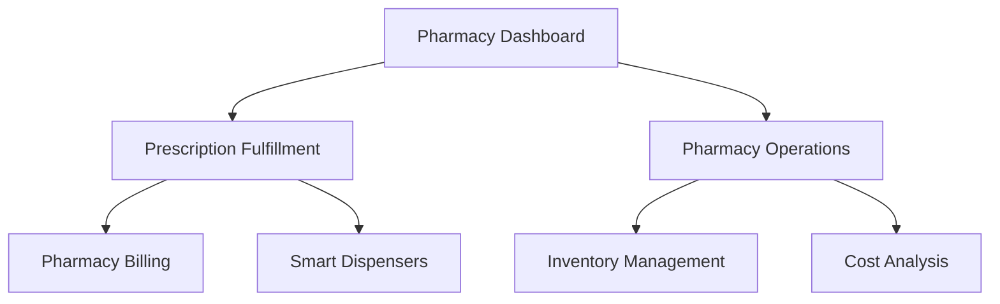

# MediFlow System Navigation & Architecture

This document breaks down the navigation flow across the various user roles within the MediFlow application into distinct, focused charts. It also outlines the core technologies powering these flows.

---

## 1. Authentication & Entry Flow

This flow covers how users enter the application and are routed to their respective dashboards based on their role.

**Tech Stack Used:**
*   **Authentication & Session Management:** Clerk
*   **Routing:** Next.js 14+ (App Router)
*   **API Client:** Axios with JWT Interceptors
*   **Backend:** FastAPI `auth.py` router with `python-jose`

---

## 2. Patient Flow

The patient portal is designed for self-service, allowing patients to manage their health journey independently.

**Tech Stack Used:**
*   **Frontend UI:** React 18+, Tailwind CSS, ShadCN UI, Lucide React icons
*   **State & Data Fetching:** TanStack Query (v5) for caching and optimistic updates
*   **Map Integration:** Custom React component with dynamic floor plans
*   **AI Integration:** Gemini API (via FastAPI backend) for Chat Assistant and Visual Triage
*   **Forms & Validation:** React Hook Form + Zod

---

## 3. Doctor Flow

The clinical interface is focused on patient care, consultations, and quick access to medical records.

**Tech Stack Used:**
*   **Backend APIs:** FastAPI routers (`appointments.py`, `consultations.py`, `patients.py`)
*   **Database:** PostgreSQL with SQLAlchemy ORM (JSONB used for flexible prescription lists)
*   **Real-time Updates:** TanStack Query for polling queue positions and emergency alerts
*   **Styling:** Next-themes for Dark/Light mode, optimizing visibility in clinical settings

---

## 4. Reception Flow

The reception interface acts as the operational hub for managing hospital logistics and patient throughput.

**Tech Stack Used:**
*   **Frontend Data Grids:** ShadCN UI Data Tables (TanStack Table)
*   **Data Models:** Complex SQL joins in FastAPI (via SQLAlchemy) to aggregate queue and appointment data
*   **State Management:** React `useState` / `useEffect` for modal interactions (Check-in, Assign Room)
*   **Audit Logging:** Backend event tracking for all status changes

---

## 5. Pharmacy Flow

The pharmacy module handles medication fulfillment, inventory tracking, and billing.

**Tech Stack Used:**
*   **Backend APIs:** FastAPI `pharmacy.py` and `billing.py`
*   **Database Schema:** Advanced PostgreSQL relations linking Prescriptions to Bills and Inventory
*   **Payments (Mocked):** Integration points for external payment gateways (e.g., Razorpay, Stripe)
*   **Forms:** React Hook Form for updating stock levels and dispensing logic
